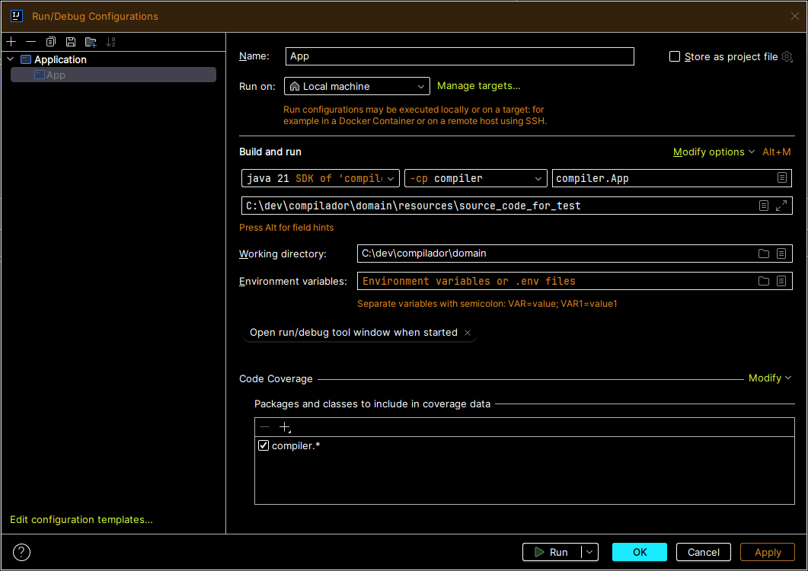

# Compiler

Compiler for the 2024.2 language.

## Running through cli

At `~/compilador/domain/compiler` folder, run:

```bash
# at domain/compiler

java -cp <path_to_bin_classes> compiler.App <path_to_txt_file> 
```

## Running through IDE

In IntelliJ IDEA, you can set a run configuration like:



# Running the compiler

After compiling the source code, a `.il` file will be generated in the same directory. 
Then, use ilasm from Microsoft .NET SDK to generate the executable file, like:

```bash
# generate exe
ilasm example.il

# run exe
./example.exe
```
